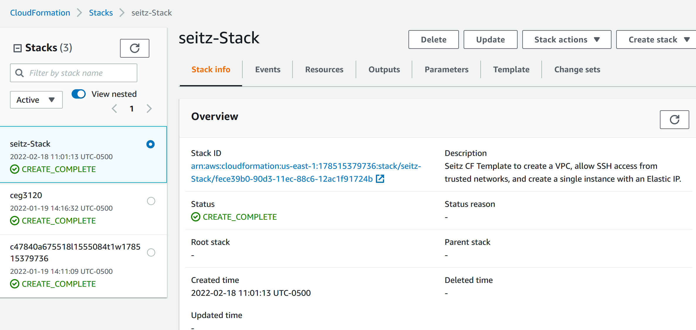
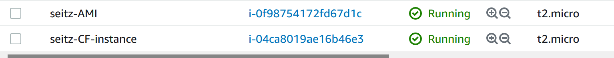
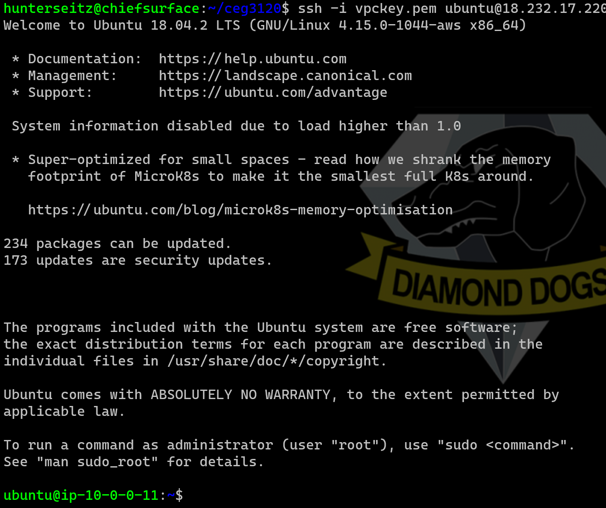

## Project 3
### Name: Hunter Seitz

# Project 3 

- The CloudFormation template file is as provided in the Project 3 folder. 

- The stack has created and ready to go: 

- Couple instances while using the instance created by the CloudFormation stack. 

- SSH into the "seitz-CF-instance" and successfully entered in. 

